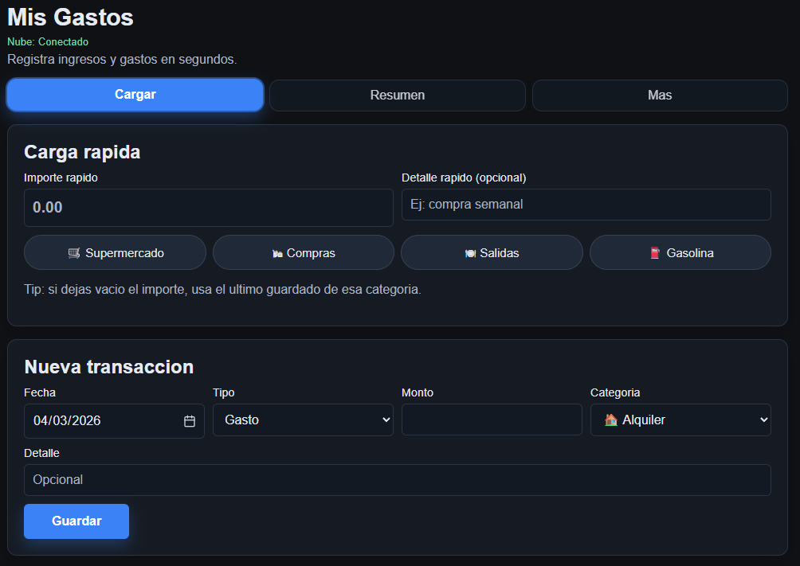
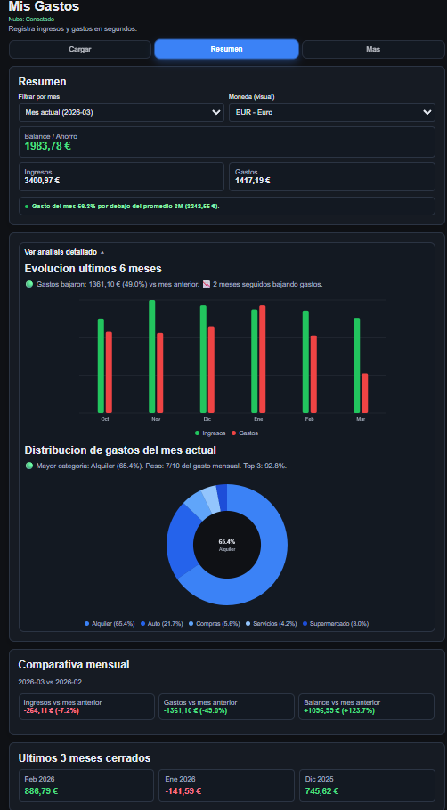
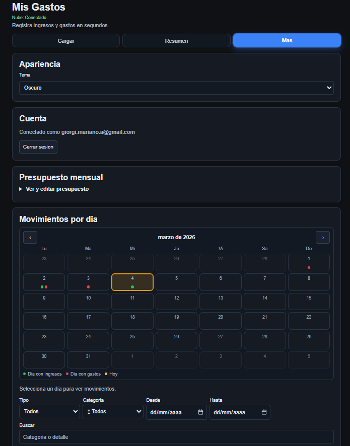
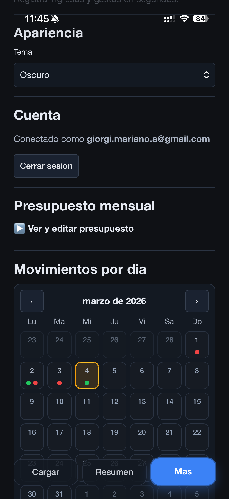
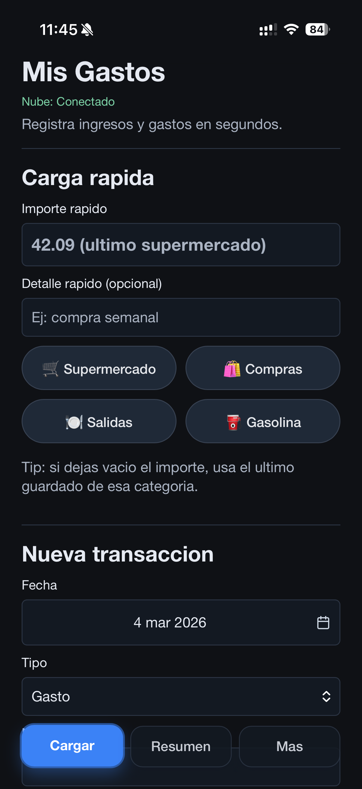
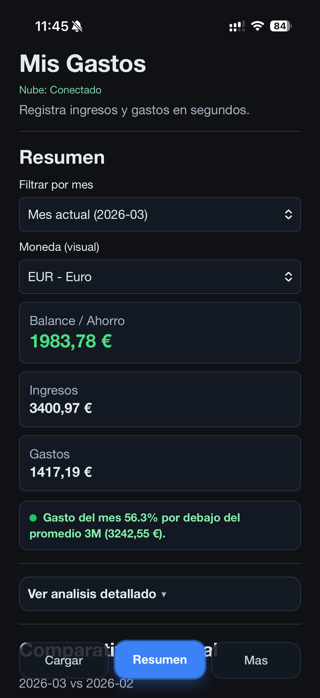

# Gastos MG

Aplicacion web tipo PWA para registrar gastos e ingresos, analizar balances mensuales y sincronizar datos en la nube con Supabase.

Demo: https://gastos-mg.vercel.app/

---

## ES - Descripcion

### Objetivo del proyecto

Construir una app de finanzas personales simple y rapida de usar desde iPhone y web, con foco en:

- carga de movimientos en segundos
- lectura mensual clara (ingresos, gastos, ahorro)
- seguimiento visual con graficos e insights

### Funcionalidades principales

- Carga rapida en 1 toque para categorias frecuentes.
- Alta manual de transacciones con categoria, fecha, detalle y tipo.
- Resumen mensual con ingresos, gastos y balance.
- Comparativas y tendencia de ultimos meses.
- Graficos interactivos (barras + donut) con tooltip en mouse/touch.
- Insight automatico de alerta de gasto (semaforo vs promedio de 3 meses cerrados).
- Calendario de movimientos por dia con edicion, duplicado y borrado.
- Exportacion a Excel de movimientos filtrados.
- Tema claro/oscuro.
- Soporte PWA (instalable en iPhone desde Safari).
- Sincronizacion en la nube con Supabase (auth + RLS).

### Capturas

#### Web





#### Mobile





### Stack tecnico

- Frontend: HTML, CSS, JavaScript vanilla
- Backend as a Service: Supabase (Auth + Postgres + REST)
- Deploy: Vercel
- Versionado: Git + GitHub

### Ejecucion local

```powershell
cd "C:\Users\MARIANO\OneDrive\Scripts\Gastos MG"
py -m http.server 8091
```

Abrir en navegador:

`http://localhost:8091/index.html?app=gastos-mg-personal`

### Uso en iPhone (como app)

1. Abrir la URL publica en Safari.
2. Compartir.
3. Agregar a pantalla de inicio.

### Seguridad y datos

- Cada usuario ve solo sus movimientos (RLS en Supabase).
- La sesion puede guardarse de forma persistente en el dispositivo.
- La app funciona en modo local aunque no haya login.
- El archivo `historico.json` publicado contiene solo datos demo (sin datos personales reales).

---

## EN - Overview

### Project goal

Build a simple, fast personal finance PWA for iPhone and web, focused on:

- quick transaction logging
- clear monthly financial overview (income, expenses, savings)
- visual tracking through charts and insights

### Key features

- One-tap quick entry for frequent expense categories.
- Manual transaction form with date, type, category and details.
- Monthly summary with income, expenses and balance.
- Monthly comparisons and trend view.
- Interactive charts (bars + donut) with mouse/touch tooltips.
- Automatic spending alert (traffic light vs last 3 closed months average).
- Day-by-day calendar with edit, duplicate and delete actions.
- Excel export for filtered transactions.
- Light/dark theme.
- PWA support (installable on iPhone from Safari).
- Cloud sync with Supabase (auth + row-level security).

### Screenshots

#### Web


#### Mobile


### Tech stack

- Frontend: HTML, CSS, Vanilla JavaScript
- Backend as a Service: Supabase (Auth + Postgres + REST)
- Deployment: Vercel
- Version control: Git + GitHub

### Run locally

```powershell
cd "C:\Users\MARIANO\OneDrive\Scripts\Gastos MG"
py -m http.server 8091
```

Open in browser:

`http://localhost:8091/index.html?app=gastos-mg-personal`

---

## Repository structure

```text
.
|- index.html
|- styles.css
|- app.js
|- historico.json
|- manifest.webmanifest
|- sw.js
|- icons/
|- docs/
|  |- images/
|- Iniciar Gastos MG.bat
|- vercel.json
|- README.md
```

## Author

Personal project by Mariano Giorgi.
